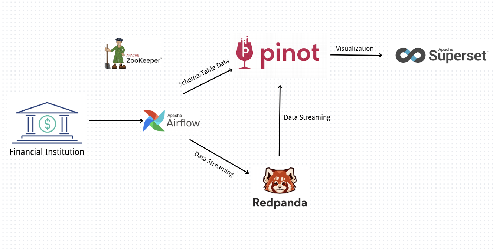
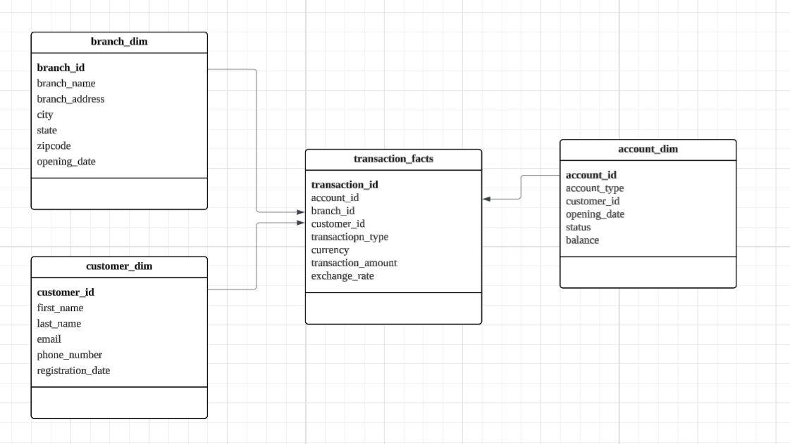

# Offline Data Warehouse


The project uses Apache airflow, redpanda, Apache Pinot and Superset to build a realtime data warehouse, including data ingestion, transportation and visualization.


### How the system works?

##### ZooKeeper:

- Resource and space manager.

##### Airflow:

- The scheduler is used to schedule tasks.
- These tasks involve (1)generating dimension data for testing and send batch to redpanda, (2) submitting schema and table to pinot, (3) generating fact data for testing and send stream to redpanda
- Airflow uses PostgreSQL to store its metadata.

##### Redpanda: 

- A distributed message queue compatible with the Kafka API.
- Redpanda is a high-performance Kafka implementation with lower latency and higher throughput.
- No JVM required, making deployment and maintenance easier.

##### Apache Pinot:

- Ingest data from real-time Kafka streams.
- Real-time OLAP data storage, optimized for filtering and aggregation.
- Ultra-low latency analytical queries with sub-second response times.

##### Apache superset:

- Drag-and-drop chart generation
- Build interactive dashboards and reports.


### How to run the pipeline?

##### Install:

- Docker desktop

##### Pull Docker image:

```
docker pull <image name>
```

- confluentinc/cp-zookeeper:7.4.0
- redpandadata/redpanda:v24.1.1
- redpandadata/console:v2.5.2
- apache/airflow:2.10.5-python3.10
- postgres:13.0
- apachepinot/pinot:1.2.0
- apache/superset:fc80861

##### Run container topo:

```
docker compose up -d
```


### Data Warehouse Architecture: Star Schema




